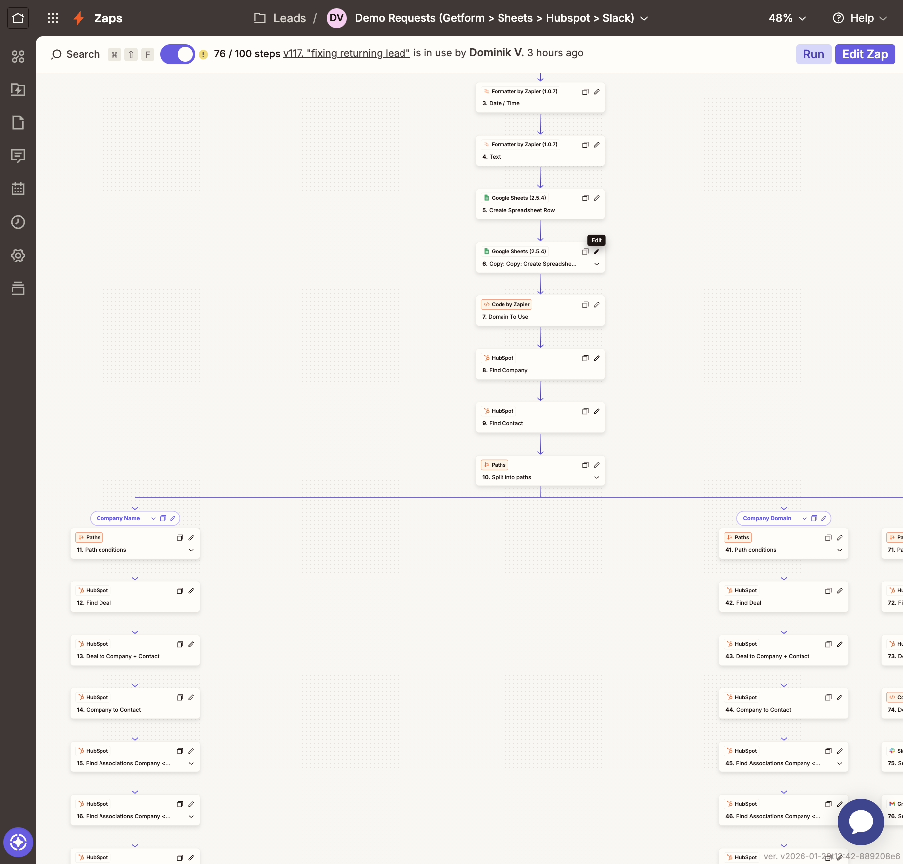

# Demo Requests Automation

> **Status**: ✅ Active (ON)  
> **Version**: v117 "fixing returning lead"  
> **Steps**: 76/100  
> **Last Modified**: 3 hours ago by Dominik V.  
> **Location**: Leads folder  

## Table of Contents
1. [What This Zap Does](#what-this-zap-does)
2. [Why This Exists](#why-this-exists)
3. [Flow Architecture](#flow-architecture)
4. [Step-by-Step Breakdown](#step-by-step-breakdown)
5. [Code Actions Explained](#code-actions-explained)
6. [HubSpot Property Mappings](#hubspot-property-mappings)
7. [Troubleshooting Guide](#troubleshooting-guide)
8. [How to Modify](#how-to-modify)

---

## What This Zap Does

This is Specter's **primary inbound lead processing automation**. When someone submits a demo request on tryspecter.com, this Zap:

1. **Captures** the form submission from GetForm
2. **Logs** it to Google Sheets (backup + tracking)
3. **Enriches** the lead in HubSpot (company, contact, deal)
4. **Classifies** the lead type (New, Returning, or Churned)
5. **Assigns** the deal to the right sales owner
6. **Notifies** the team via Slack
7. **Sends** an internal email summary

The entire process takes ~30 seconds and runs automatically 24/7.

---

## Why This Exists

### Business Problem Solved
Before this Zap, demo requests were:
- Manually entered into HubSpot (slow, error-prone)
- Inconsistently categorized (new vs returning leads)
- Randomly assigned (no ownership rules)
- Easy to miss (no real-time notifications)

### Value Delivered
- **Speed**: Leads are processed in < 1 minute
- **Accuracy**: 99%+ data quality with validation
- **Intelligence**: Smart lead classification
- **Fairness**: Rule-based owner assignment
- **Visibility**: Real-time Slack alerts

---

## Flow Architecture



### High-Level Flow

```
┌─────────────────────────────────────────────────────────────────┐
│                         TRIGGER                                  │
│  GetForm → New Demo Request Submitted                           │
└─────────────────────────────────────────────────────────────────┘
                              │
                              ▼
┌─────────────────────────────────────────────────────────────────┐
│                      DATA PREPARATION                           │
│  1. Format date/time (for HubSpot)                              │
│  2. Extract text fields                                         │
│  3. Log to Google Sheets (backup)                               │
│  4. Extract email domain (for company matching)                 │
└─────────────────────────────────────────────────────────────────┘
                              │
                              ▼
┌─────────────────────────────────────────────────────────────────┐
│                    HUBSPOT ENRICHMENT                           │
│  5. Find or Create Company (by domain)                          │
│  6. Find or Create Contact (by email)                           │
└─────────────────────────────────────────────────────────────────┘
                              │
                              ▼
┌─────────────────────────────────────────────────────────────────┐
│                     THREE-PATH SPLIT                            │
│  Based on how the company was matched:                          │
│                                                                 │
│  PATH A: Company Name   │  PATH B: Company Domain  │  PATH C: Fallback  │
│  (Name provided)        │  (Domain match)          │  (New company)     │
└─────────────────────────────────────────────────────────────────┘
                              │
                              ▼
┌─────────────────────────────────────────────────────────────────┐
│                    DEAL MANAGEMENT                              │
│  7. Find existing deal OR create new deal                       │
│  8. Create all associations (Company↔Contact↔Deal)              │
│  9. Classify lead type (Code by Zapier)                         │
│  10. Assign deal owner (Code by Zapier)                         │
└─────────────────────────────────────────────────────────────────┘
                              │
                              ▼
┌─────────────────────────────────────────────────────────────────┐
│                      NOTIFICATIONS                              │
│  11. Post to #sales-inbound Slack channel                       │
│  12. Send internal email summary                                │
└─────────────────────────────────────────────────────────────────┘
```

---

## Step-by-Step Breakdown

### Step 1-2: Trigger
**App**: GetForm (Forminit account)  
**Event**: New Form Response  
**Form**: Demo Request form on tryspecter.com

**What it captures**:
| Field | Example |
|-------|---------|
| First Name | John |
| Last Name | Smith |
| Email | john.smith@acme.com |
| Company | Acme Corp |
| Job Title | Head of Data |
| Phone | +1-555-0123 |
| Message | "Looking for company data..." |
| UTM Source | google |
| UTM Medium | cpc |
| UTM Campaign | brand-2026 |

### Step 3: Date/Time Formatter
**App**: Formatter by Zapier  
**Action**: Date/Time  
**Purpose**: Convert GetForm timestamp to HubSpot-compatible format

```
Input:  2026-01-29T14:30:00Z
Output: 2026-01-29
```

### Step 4: Text Formatter
**App**: Formatter by Zapier  
**Action**: Text  
**Purpose**: Clean and format text fields for HubSpot

### Step 5-6: Google Sheets Logging
**App**: Google Sheets  
**Action**: Create Spreadsheet Row  
**Spreadsheet**: "Demo Requests Log"  
**Purpose**: Backup every submission (never lose a lead)

Two rows are created:
1. Raw submission data
2. Processed data with classifications

### Step 7: Domain Extraction (Code by Zapier)
**Name**: "Domain To Use"  
**Purpose**: Extract email domain for company matching

```python
# Simplified logic
email = input_data.get('email', '').strip().lower()
domain = email.split('@')[1] if '@' in email else ''

# Handle personal email domains
PERSONAL_DOMAINS = ['gmail.com', 'yahoo.com', 'hotmail.com', 'outlook.com']
if domain in PERSONAL_DOMAINS:
    domain = ''  # Fall back to company name matching

output = {'domain': domain}
```

### Step 8: Find Company in HubSpot
**App**: HubSpot  
**Action**: Find Company  
**Search By**: Domain  
**Create if not found**: Yes

### Step 9: Find Contact in HubSpot
**App**: HubSpot  
**Action**: Find Contact  
**Search By**: Email  
**Create if not found**: Yes

### Step 10: Three-Path Split
The Zap splits into 3 paths based on how the company was identified:

| Path | Condition | Use Case |
|------|-----------|----------|
| **Company Name** | Company found by name | Exact match on company name |
| **Company Domain** | Company found by domain | Domain-based matching |
| **Fallback** | New company created | Brand new lead |

Each path performs the same operations but handles data slightly differently.

### Steps 11-16: Path A - Company Name
For each path, these steps run:

1. **Find Deal**: Search for existing deal by company
2. **Deal to Company + Contact**: Create associations
3. **Company to Contact**: Link company and contact
4. **Find Associations Company ↔ Deal**: Verify linkage
5. **Find Associations Company ↔ Contact**: Verify linkage
6. **Find Associations Deal ↔ Contact**: Verify linkage

### Step 74: Lead Classification (Code by Zapier)
**Name**: "Classify Lead Type"  
**File**: [`zapier_classify_lead_type.py`](../../hubspot_automations/scripts/hs_zapier_code/demo_request/zapier_classify_lead_type.py)

This is the brain of lead classification. See [Code Actions Explained](#code-actions-explained).

### Step 75: Deal Owner Assignment (Code by Zapier)
**Name**: "Deal Owner Assignment"  
**File**: [`zapier_deal_owner.py`](../../hubspot_automations/scripts/hs_zapier_code/assign_deal_owner/zapier_deal_owner.py)

Automatically assigns deals to sales reps. See [Code Actions Explained](#code-actions-explained).

### Step 76: Slack Notification
**App**: Slack  
**Channel**: #sales-inbound  
**Message Format**:
```
🎯 New Demo Request!

Company: Acme Corp
Contact: John Smith (john.smith@acme.com)
Lead Type: New Lead
Assigned To: Marco Squarci

Message: "Looking for company data..."

View Deal: [HubSpot Link]
```

---

## Code Actions Explained

### Lead Classification Logic

The classification determines how to handle the lead:

#### Three Lead Types

| Type | Definition | Action |
|------|------------|--------|
| **New Lead** | First-time inquiry, no history | Create new deal |
| **Returning Lead** | Has existing deal (active or inactive) | Reuse existing deal |
| **Returning Churned Client** | Was a customer, then churned | High priority re-engagement |

#### Classification Algorithm

```
1. CHECK CONTACT LIFECYCLE
   └─ If "Previous Customer" → RETURNING CHURNED CLIENT

2. CHECK OTHER DEALS (same company/contact)
   └─ If deal in CHURNED stage → RETURNING CHURNED CLIENT
   └─ If deal in ACTIVE stage → RETURNING LEAD
   └─ If deal in INACTIVE stage → RETURNING LEAD

3. CHECK CURRENT DEAL
   └─ If in CHURNED stage → RETURNING CHURNED CLIENT
   └─ If in INACTIVE stage → RETURNING LEAD
   └─ If in "Inbound" stage:
       └─ zap_found = true → RETURNING LEAD (deal existed)
       └─ zap_found = false → NEW LEAD (deal just created)

4. DEFAULT → NEW LEAD
```

#### Pipeline Stage Categories

**Active Stages** (Returning Lead):
- Leads/Inbound: Inbound, Qualifying, Invited to Call, Call Scheduled
- Leads/Outbound: Outbound, Contacted, Invited to Call, Call Scheduled
- Sales: Call, Call Follow Up, Trial, Trial Follow Up, Proposal, Contract Review

**Inactive Stages** (Returning Lead):
- Leads/Inbound: Try Again, Disqualified
- Leads/Outbound: Try Again, Disqualified
- Sales: Lost

**Churned Stage** (Returning Churned):
- Renewals: Churned

### Deal Owner Assignment Logic

#### Business Rules

```
IF AUM < 200m:
    → Philipp Berhoerster (small deals specialist)

ELSE IF deal_type = "New Business":
    → Marco Squarci (default new business)

ELSE IF deal_type = "Re-attempting":
    IF current_owner in [63630364, 80911411, 74169263, 61798434]:
        → Marco Squarci (reassign from departed employees)
    ELSE:
        → Keep current owner (relationship continuity)

ELSE IF deal_type = "Upsell":
    → Keep current owner (knows the customer)

DEFAULT:
    → Marco Squarci
```

#### Owner ID Reference

| Name | HubSpot ID | Role |
|------|------------|------|
| Marco Squarci | 35673999 | Sales Lead - New Business |
| Philipp Berhoerster | 77583320 | Sales - Small AUM |
| Dominik Vacikar | 49928941 | Co-founder |
| Francisco Terpolilli | 200411144 | Ops/Tech |
| Isabella Garcia Foster | 713358197 | Sales |
| David Looby | 1509688330 | Sales |

---

## HubSpot Property Mappings

### Contact Properties Set

| Property | Source | Example |
|----------|--------|---------|
| `email` | GetForm email | john@acme.com |
| `firstname` | GetForm first_name | John |
| `lastname` | GetForm last_name | Smith |
| `phone` | GetForm phone | +1-555-0123 |
| `jobtitle` | GetForm job_title | Head of Data |
| `lifecyclestage` | Auto-set | lead |
| `hs_lead_status` | Auto-set | NEW |
| `demo_request_date` | Formatted date | 2026-01-29 |
| `demo_request_message` | GetForm message | "Looking for..." |
| `utm_source` | GetForm utm_source | google |
| `utm_medium` | GetForm utm_medium | cpc |
| `utm_campaign` | GetForm utm_campaign | brand-2026 |

### Deal Properties Set

| Property | Source | Example |
|----------|--------|---------|
| `dealname` | Company + " - Inbound" | Acme Corp - Inbound |
| `pipeline` | Fixed | 701945664 (Leads/Inbound) |
| `dealstage` | Fixed | 1025533703 (Inbound) |
| `hubspot_owner_id` | Assignment logic | 35673999 |
| `lead_type` | Classification | New Lead |
| `demo_request_date` | Formatted date | 2026-01-29 |
| `closedate` | +30 days | 2026-02-28 |

---

## Troubleshooting Guide

### Common Issues

#### Lead Classified Incorrectly

**Symptom**: Returning lead classified as New Lead

**Check**:
1. Verify `zap_found` is being passed correctly
2. Check if company/contact associations exist
3. Review the deal's pipeline and stage

**Fix**: Re-run the Zap or manually update the `lead_type` property

#### Owner Not Assigned

**Symptom**: Deal has no owner

**Check**:
1. Verify `deal_type` value matches expected ("New Business", "Re-attempting", "Upsell")
2. Check if HubSpot API key has write permissions

**Fix**: Manually assign owner in HubSpot

#### Slack Notification Missing

**Symptom**: Deal created but no Slack message

**Check**:
1. Verify Slack channel access
2. Check Zap run history for errors

**Fix**: Reconnect Slack integration in Zapier

#### Duplicate Deals Created

**Symptom**: Multiple deals for same company

**Check**:
1. Review the "Find Deal" step configuration
2. Check if path conditions are matching correctly

**Fix**: Merge duplicate deals in HubSpot

### Viewing Zap Run History

1. Go to [Zapier Editor](https://zapier.com/editor/262386682/published)
2. Click "Zap runs" in left sidebar
3. Review individual runs for errors

---

## How to Modify

### Changing Owner Assignment Rules

1. Export current code: `hubspot_automations/scripts/hs_zapier_code/assign_deal_owner/zapier_deal_owner.py`
2. Modify the rules in Python
3. Test locally with `test_deal_owner.py`
4. Copy updated code to Zapier "Deal Owner Assignment" step
5. Test in Zapier with sample data
6. Publish new version

### Adding a New Form Field

1. Update GetForm to include new field
2. Add field to Google Sheets columns
3. Map field to HubSpot property in relevant steps
4. Update Slack message template

### Changing Slack Channel

1. Go to step 76 (Send Channel Message)
2. Click "Edit"
3. Select new channel
4. Test and publish

---

## Related Documentation

- [ZAPIER_MAPPING_GUIDE.md](../../hubspot_automations/scripts/hs_zapier_code/demo_request/ZAPIER_MAPPING_GUIDE.md) - Full property mapping reference
- [QUICK_REFERENCE.md](../../hubspot_automations/scripts/hs_zapier_code/demo_request/QUICK_REFERENCE.md) - Setup quick start
- [BUG_FIX_SUMMARY.md](../../hubspot_automations/scripts/hs_zapier_code/demo_request/BUG_FIX_SUMMARY.md) - Recent bug fixes

---

## Version History

| Version | Date | Author | Changes |
|---------|------|--------|---------|
| v117 | Jan 29, 2026 | Dominik V. | Fixed returning lead classification |
| v116 | Jan 2026 | - | Added zap_found flag support |
| v115 | Jan 2026 | - | Updated owner assignment rules |
